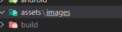

# flutter 入门

## first app

创建一个的组件

```dart
void main(List<String> args) {
  runApp(const MyApp());
}

class MyApp extends StatelessWidget {
  const MyApp({super.key});
  @override
  Widget build(BuildContext context) {
    final wordPair = WordPair.random();
    return MaterialApp(
      title: 'Welcome to Flutter',
      home: Scaffold(
        appBar: AppBar(
          title: const Text('这是我的第一个页面'),
        ),
        body:const Center(
          child: RandomWords(),
        ),
      ),
    );
  }
}
```

widget 是一个组件类，用于构建ui和页面。

## flutter 状态组件

```dart
class RandomWords extends StatefulWidget {
  const RandomWords({ Key? key }) : super(key: key);
  @override
  State<RandomWords> createState() => _RandomWordsState();
}

class _RandomWordsState extends State<RandomWords> {
  @override
  Widget build(BuildContext context) {
    final wordPair = WordPair.random();
    return Text(wordPair.asPascalCase);
  }
}
```

可以通过继承state来创建一个状态组件

同时可以在extends StatefulWidget的情况下：生成一个state

## Create an infinite scrolling ListView

创建无限列表：

1 声明一个字体样式和一个数组 在state私有类里面

```dart
final _suggestions = <WordPair>[];
final _biggerFont = const TextStyle(fontSize: 18);
```

返回一个listView的builder

```dart
@override
Widget build(BuildContext context) {
    return ListView.builder(
        padding: const EdgeInsets.all(16.0),
        itemBuilder: /*1*/ (context, i) {
            if (i.isOdd) return const Divider(); /*2*/

            final index = i ~/ 2; /*3*/
            if (index >= _suggestions.length) {
                _suggestions.addAll(generateWordPairs().take(10)); /*4*/
            }
            return Text(_suggestions[index].asPascalCase);
        },
    );
}
```

这样应该就会出现一个无限滚动的listview了

更改一下：构建一个listTile

```dart
return ListTile(
    title: Text(
    _suggestions[index].asPascalCase,
    style: _biggerFont,
    ),
);
```

##  给每一个listtile添加事件和icon

```dart
// 这是添加一个icon 
trailing: Icon(
    // NEW from here ...
    alreadySaved ? Icons.favorite : Icons.favorite_border,
    color: alreadySaved ? Colors.red : null,
    semanticLabel: alreadySaved ? 'Remove from saved' : 'Save',
),
//添加事件 当tap的时候 就会执行一个setState()的方法 这个方法会传入一个匿名函数 里面就可以做一些事情
onTap: () {
    setState(() {
        if (alreadySaved) {
            _saved.remove(_suggestions[index]);
        } else {
            _saved.add(_suggestions[index]);
        }
    });
},
```

可以看到 trailing是放在listtile右边的插槽

我们对这个listtile添加一个onTap 就可以给每一个listTile添加事件。

## 导航到新页面

删掉myApp里的一些内容，并且将其改成这样

```dart
Widget build(BuildContext context) {
    return const MaterialApp(
        title: 'startup name generator',
        home: RandomWords(),
    );
}
```

改造RandomWordsState 返回一个Scaffold

```dart
Widget build(BuildContext context) {
    return Scaffold(
      appBar: AppBar(
        title: const Text('Startup Name Generator'),
        actions: [
          IconButton(
            icon: const Icon(Icons.list),
            onPressed: _pushSaved,
            tooltip: 'Saved Suggestions',
          ),
        ],
      ),
      body: ListView.builder(
        itemBuilder: /*1*/ (context, i) {
            final index = i ~/ 2; /*3*/
            var alreadySaved = false;
            if (_suggestions.isNotEmpty && index < _suggestions.length) {
              alreadySaved = _saved.contains(_suggestions[index]); // NEW
            }
            if (i.isOdd) return const Divider(); /*2*/
            if (index >= _suggestions.length) {
              _suggestions.addAll(generateWordPairs().take(10)); /*4*/
            }
            return ListTile(
              //list tile 拥有一个标题 这里设置为一个text
              title: Text(
                _suggestions[index].asPascalCase,
                style: _biggerFont,
              ),
              // 这是添加一个icon
              trailing: Icon(
                // NEW from here ...
                alreadySaved ? Icons.favorite : Icons.favorite_border,
                color: alreadySaved ? Colors.red : null,
                semanticLabel: alreadySaved ? 'Remove from saved' : 'Save',
              ),
              //添加事件 当tap的时候 就会执行一个setState()的方法 这个方法会传入一个匿名函数 里面就可以做一些事情
              onTap: () {
                setState(() {
                  if (alreadySaved) {
                    _saved.remove(_suggestions[index]);
                  } else {
                    _saved.add(_suggestions[index]);
                  }
                });
              },
            );
            ;
          },
      ));
  }
```

我们对RandomWordsState 添加一个私有的跳转方法

```dart
void _pushSaved() {
    Navigator.of(context).push();
}
```

添加逻辑

```dart
void _pushSaved() {
    Navigator.of(context).push(
      MaterialPageRoute<void>(
        builder: (context) {
          final tiles = _saved.map(
            (pair) {
              return ListTile(
                title: Text(
                  pair.asPascalCase,
                  style: _biggerFont,
                ),
              );
            },
          );
          final divided = tiles.isNotEmpty
              ? ListTile.divideTiles(
                  context: context,
                  tiles: tiles,
                ).toList()
              : <Widget>[];

          return Scaffold(
            appBar: AppBar(
              title: const Text('Saved Suggestions'),
            ),
            body: ListView(children: divided),
          );
        },
      ), // ...to here.
    );
  }
```

可以看到 会返回一个Scaffold 并且拥有appBar 和body

这样就可以在点进去之后，跳转到一个页面中了~

## 更改样式和主题

```dart
theme: ThemeData(
          // Add the 5 lines from here...
        appBarTheme: const AppBarTheme(
          backgroundColor: Colors.orange,
          foregroundColor: Colors.green,
      )),
```

在myapp里加上themeData


## flutter 布局

flutter一般最外层需要一个Scaffold来包裹

如果没有这个元素 则需要设置内部文字的对齐方式

```dart
return Center(
    child: Container(
        width: 300,
        height: 300,
        decoration: BoxDecoration(
            color: Colors.blue,
            border: Border.all(
                color: Colors.black,
                width: 2,
            ),
        ),
        child: const Text('这都是些啥啊 啊啊啊啊',
                          style: TextStyle(
                              fontSize: 20,
                              color: Colors.black,
                          ),
                          textDirection: TextDirection.ltr),
    ),
);
```

Container 还有很多其他设置

```dart
width: 300,
height: 300,
decoration: BoxDecoration(
    color: Colors.blue,
    border: Border.all(
        color: Colors.black,
        width: 2,
    ),
),
padding:const EdgeInsets.all(10), // 内边距
alignment: Alignment.center, // 内容居中
child: const Text('这都是些啥啊 啊啊啊啊',
                  style: TextStyle(
                      fontSize: 20,
                      color: Colors.black,
                  ),
                  textDirection: TextDirection.ltr),
```

### 文本组件属性

```dart
const Text('dsghaughoihgoishgoiahgoiahgoia',
            style: TextStyle(
              fontSize: 20,
              // color: Colors.black,
              color: Colors.black,
              fontFamily: 'Roboto',
              fontWeight: FontWeight.w500,
              fontStyle: FontStyle.italic,
              decoration: TextDecoration.underline
            ),
            textDirection: TextDirection.ltr,
            textAlign: TextAlign.center,
            overflow: TextOverflow.ellipsis),
```

### 图片

```dart
child: Image.network(
              "https://storage.googleapis.com/cms-storage-bucket/740d82517a6f13db51bd.png",
              fit: BoxFit.cover)), 
```

配置本地资源路径

首先需要新建好路径文件夹



放入图片后在pubspec配置文件下配置路径

```yml
  # To add assets to your application, add an assets section, like this:
  assets:
   - assets/images/touxiang.jpg
```

```dart
child: Image.asset(
              "../assets/images/touxiang.jpg",
              fit: BoxFit.fitHeight)), 
```

asset引用

### 模板使用

在flutter中我们必须在app组件中含有MaterialAppy以及一个Scaffold

所以我们可以新建一个类，这个类写我们的布局，而其他的东西保持在MyApp中不变，

```dart
class MyApp extends StatelessWidget {
  const MyApp({super.key});
  @override
  Widget build(BuildContext context) {
    return MaterialApp(
      home: Scaffold(
        appBar: AppBar(
          title: const Text('Flutter Demo'),
        ),
        body: HomeContent(),//这里就是放组件的位置
      ),
      theme: ThemeData(
        primarySwatch: Colors.blue,
      ),
    );
  }
}
```

组件：

```dart
class HomeContent extends StatelessWidget {
  List list = [];
  HomeContent({super.key}) {
    for (int i = 0; i < 100; i++) {
      list.add("我是第$i条数据");
    }
  }
  @override
  Widget build(BuildContext context) {
    return Center(
        child: ListView.builder(
      itemCount: list.length,
      itemBuilder: (context, index) {
        return ListTile(
          leading: const Icon(Icons.android),
          title: Text(list[index]),
          subtitle: Text("我是子标题$index"),
          trailing: const Icon(Icons.arrow_right_rounded),
        );
      },
      padding: const EdgeInsets.all(10),
    ));
  }
}
```

### flex布局

这里我们对flex进行布局

如果需要子元素是可伸缩的 ，那么只需要指定他为Expanded

```dart
child: Flex(direction: Axis.horizontal, children: <Widget>[
    //固定大小的子元素
    Container(
        width: 100,
        height: 100,
        color: Colors.red,
    ),
    // 可伸缩的子元素
    Expanded(
        flex: 1,
        child: Container(
            height: 100,
            width: 100,
            color: Colors.green,
        ),
    )
]),
```

flex 的分布

```dart
mainAxisAlignment: MainAxisAlignment.center,
```

flex 的alignitems

```dart
crossAxisAlignment: CrossAxisAlignment.center,
```

### 快捷的Flex Row和Column

只需要吧Flex缓存Row或者Column 那么组件就会自动指定主轴，不需要我们指定了

```dart
Column(
    mainAxisAlignment: MainAxisAlignment.spaceBetween,
    crossAxisAlignment: CrossAxisAlignment.center,
    children: <Widget>[
        //固定大小的子元素
        Container(
            width: 100,
            height: 400,
            color: Colors.red,
        ),
        Container(
            width: 200,
            height: 100,
            color: Colors.blue,
        ),
    ]),
```

### 定位和堆叠

```dart
child: Stack(
    children: [
        Container(
            height: 200,
            width: 200,
            color: Colors.red,
        ),
        Container(
            height: 180,
            width: 180,
            color: Colors.blue,
        ),
        Container(
            height: 160,
            width: 160,
            color: Colors.yellow,
        ),
    ],
)));
```

这里可以看到建了三个container ，而且他们都堆在了一起

通过Positioned组件可以给他的子元素进行定位

```dart
Positioned(
                  left: 150,
                  child: Container(
                    width: 300,
                    height: 300,
                    color: Colors.red,
                  ),
                ),
```

### 底部导航栏

```dart
import 'package:flutter/material.dart';

/// 案例1：简单的无限列表示例
void main(List<String> args) {
  runApp(const MyApp());
}

class MyApp extends StatelessWidget {
  const MyApp({super.key});
  @override
  Widget build(BuildContext context) {
    return MaterialApp(
      home: Tabs(),
      theme: ThemeData(
        primarySwatch: Colors.blue,
      ),
    );
  }
}

class Tabs extends StatefulWidget {
  const Tabs({Key? key}) : super(key: key);
  @override
  State<StatefulWidget> createState() {
    return _TabsState();
  }
}

class _TabsState extends State<Tabs> {
  List<Widget> list = [HomePage(), MyPage(), AboutPage()];
  int _currentIndex = 0;
  @override
  Widget build(BuildContext context) {
    // TODO: implement build
    return Scaffold(
      appBar: AppBar(
        title: const Text('这是导航栏'),
      ),
      body: list[_currentIndex],
      bottomNavigationBar: BottomNavigationBar(
        currentIndex: _currentIndex,
        onTap: (int index) {
          setState(() {
            _currentIndex = index;
          });
        },
        fixedColor: Colors.blue,
        items: const [
          BottomNavigationBarItem(
            icon: Icon(Icons.home),
            label: '首页',
          ),
          BottomNavigationBarItem(
            icon: Icon(Icons.list),
            label: '列表',
          ),
          BottomNavigationBarItem(
            icon: Icon(Icons.info),
            label: '关于',
          ),
        ],
      ),
    );
  }
}

class HomePage extends StatelessWidget {
  const HomePage({Key? key}) : super(key: key);
  @override
  Widget build(BuildContext context) {
    return Container(
      alignment: Alignment.center,
      color: Colors.red,
      child: const Text('这是首页'),
    );
  }
}

class MyPage extends StatelessWidget {
  const MyPage({Key? key}) : super(key: key);
  @override
  Widget build(BuildContext context) {
    return Container(
      alignment: Alignment.center,
      color: Colors.blueGrey,
      child: const Text('这是我的页面'),
    );
  }
}

class AboutPage extends StatelessWidget {
  const AboutPage({Key? key}) : super(key: key);
  @override
  Widget build(BuildContext context) {
    return Container(
      alignment: Alignment.center,
      color: Colors.green,
      child: const Text('关于我'),
    );
  }
}
```

### 路由传参

通过构造函数，可以进行路由的传参：

```dart
final String title;
const MySearchPage({Key? key, required this.title}) : super(key: key);

homepage
    
ElevatedButton(
    child: const Text('跳转到第二页'),
    onPressed: () {
        Navigator.of(context).push(
            MaterialPageRoute(
                builder: (context) {
                    return MySearchPage(title: '这是搜索');
                }, //括号里可以传参
            ),
        );
    },
),
```

同时可以在pushNamed的时候携带argument，这个需要通过Modal等东西去获取到数据。

```dart
ModalRoute.of(context)?.settings.arguments
```

### 表单

使用textFild可以设置表单

```dart
TextField(
    decoration:
    InputDecoration(hintText: '输入用户名', icon: Icon(Icons.people)),
)
```

```dart
TextField(
    decoration:
    InputDecoration(hintText: '输入用户名', icon: Icon(Icons.people)),
    onChanged: (value) {
        setState(() {
            _msg = value;
        });
    },
),
```

### 状态管理方案

使用自带的provider

```dart
ChangeNotifierProvider<UserInfo>.value(
      value: UserInfo("我是adk", "nickname", 12);
      child: MyApp(),
  )
```

通过ChangeNotifierProvider 可以给指定的子组件传入对于的值

```dart
home: Scaffold(
    appBar: AppBar(
        title: Text('你好'),
    ),
    body: Text("你的用户名是${Provider.of<UserInfo>(context).username}"),
),
```

这样去接受provider的值

### 路由管理方案 fluro

```dart
void main(List<String> args) {
    FluroRouter router = FluroRouter();
    Routes.configureRoutes(router);
    Application.router = router;
    runApp(MyApp());
}

class MyApp extends StatelessWidget {
    @override
    Widget build(BuildContext context) {
        return MaterialApp(
            title: '我的app2',
            onGenerateRoute: Application.router.generator,
            theme: ThemeData(
                primarySwatch: Colors.blue,
            ),
            home: MyHomePage(title: 'Flutter Demo Home Page'),
        );
    }
}

class Application {
    static FluroRouter router = FluroRouter();
}

class Routes {
    static void configureRoutes(FluroRouter router) {
        router.define('/',
                      handler: Handler(
                          handlerFunc: (context, params) =>
                          MyHomePage(title: 'Flutter Demo Home Page'),
                      ));
        router.define("/sb",
                      handler: Handler(
                          handlerFunc: (context, params) => MyHomePage(title: 'this sb page'),
                      ));
        router.notFoundHandler = Handler(
            handlerFunc: (context, params) => PageEmpty(),
        );
    }
}
```

我们可以依赖一些第三方的包来做到route的路由管理，这里需要注意要使用2.0版本以上的包，并且写法发生了改变，需要使用**static FluroRouter router = FluroRouter()**

在routes里面去定义相应的路由就可以使用router了。

