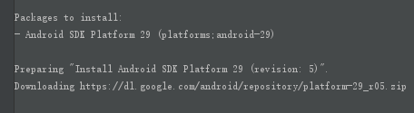

# flutter 入门

## first app

创建一个的组件

```dart
void main(List<String> args) {
  runApp(const MyApp());
}

class MyApp extends StatelessWidget {
  const MyApp({super.key});
  @override
  Widget build(BuildContext context) {
    final wordPair = WordPair.random();
    return MaterialApp(
      title: 'Welcome to Flutter',
      home: Scaffold(
        appBar: AppBar(
          title: const Text('这是我的第一个页面'),
        ),
        body:const Center(
          child: RandomWords(),
        ),
      ),
    );
  }
}
```

widget 是一个组件类，用于构建ui和页面。

## flutter 状态组件

```dart
class RandomWords extends StatefulWidget {
  const RandomWords({ Key? key }) : super(key: key);
  @override
  State<RandomWords> createState() => _RandomWordsState();
}

class _RandomWordsState extends State<RandomWords> {
  @override
  Widget build(BuildContext context) {
    final wordPair = WordPair.random();
    return Text(wordPair.asPascalCase);
  }
}
```

可以通过继承state来创建一个状态组件

同时可以在extends StatefulWidget的情况下：生成一个state

## Create an infinite scrolling ListView

创建无限列表：

1 声明一个字体样式和一个数组 在state私有类里面

```dart
final _suggestions = <WordPair>[];
final _biggerFont = const TextStyle(fontSize: 18);
```

返回一个listView的builder

```dart
@override
Widget build(BuildContext context) {
    return ListView.builder(
        padding: const EdgeInsets.all(16.0),
        itemBuilder: /*1*/ (context, i) {
            if (i.isOdd) return const Divider(); /*2*/

            final index = i ~/ 2; /*3*/
            if (index >= _suggestions.length) {
                _suggestions.addAll(generateWordPairs().take(10)); /*4*/
            }
            return Text(_suggestions[index].asPascalCase);
        },
    );
}
```

这样应该就会出现一个无限滚动的listview了

更改一下：构建一个listTile

```dart
return ListTile(
    title: Text(
    _suggestions[index].asPascalCase,
    style: _biggerFont,
    ),
);
```

##  给每一个listtile添加事件和icon

```dart
// 这是添加一个icon 
trailing: Icon(
    // NEW from here ...
    alreadySaved ? Icons.favorite : Icons.favorite_border,
    color: alreadySaved ? Colors.red : null,
    semanticLabel: alreadySaved ? 'Remove from saved' : 'Save',
),
//添加事件 当tap的时候 就会执行一个setState()的方法 这个方法会传入一个匿名函数 里面就可以做一些事情
onTap: () {
    setState(() {
        if (alreadySaved) {
            _saved.remove(_suggestions[index]);
        } else {
            _saved.add(_suggestions[index]);
        }
    });
},
```

可以看到 trailing是放在listtile右边的插槽

我们对这个listtile添加一个onTap 就可以给每一个listTile添加事件。

## 导航到新页面

删掉myApp里的一些内容，并且将其改成这样

```dart
Widget build(BuildContext context) {
    return const MaterialApp(
        title: 'startup name generator',
        home: RandomWords(),
    );
}
```

改造RandomWordsState 返回一个Scaffold

```dart
Widget build(BuildContext context) {
    return Scaffold(
      appBar: AppBar(
        title: const Text('Startup Name Generator'),
        actions: [
          IconButton(
            icon: const Icon(Icons.list),
            onPressed: _pushSaved,
            tooltip: 'Saved Suggestions',
          ),
        ],
      ),
      body: ListView.builder(
        itemBuilder: /*1*/ (context, i) {
            final index = i ~/ 2; /*3*/
            var alreadySaved = false;
            if (_suggestions.isNotEmpty && index < _suggestions.length) {
              alreadySaved = _saved.contains(_suggestions[index]); // NEW
            }
            if (i.isOdd) return const Divider(); /*2*/
            if (index >= _suggestions.length) {
              _suggestions.addAll(generateWordPairs().take(10)); /*4*/
            }
            return ListTile(
              //list tile 拥有一个标题 这里设置为一个text
              title: Text(
                _suggestions[index].asPascalCase,
                style: _biggerFont,
              ),
              // 这是添加一个icon
              trailing: Icon(
                // NEW from here ...
                alreadySaved ? Icons.favorite : Icons.favorite_border,
                color: alreadySaved ? Colors.red : null,
                semanticLabel: alreadySaved ? 'Remove from saved' : 'Save',
              ),
              //添加事件 当tap的时候 就会执行一个setState()的方法 这个方法会传入一个匿名函数 里面就可以做一些事情
              onTap: () {
                setState(() {
                  if (alreadySaved) {
                    _saved.remove(_suggestions[index]);
                  } else {
                    _saved.add(_suggestions[index]);
                  }
                });
              },
            );
            ;
          },
      ));
  }
```

我们对RandomWordsState 添加一个私有的跳转方法

```dart
void _pushSaved() {
    Navigator.of(context).push();
}
```

添加逻辑

```dart
void _pushSaved() {
    Navigator.of(context).push(
      MaterialPageRoute<void>(
        builder: (context) {
          final tiles = _saved.map(
            (pair) {
              return ListTile(
                title: Text(
                  pair.asPascalCase,
                  style: _biggerFont,
                ),
              );
            },
          );
          final divided = tiles.isNotEmpty
              ? ListTile.divideTiles(
                  context: context,
                  tiles: tiles,
                ).toList()
              : <Widget>[];

          return Scaffold(
            appBar: AppBar(
              title: const Text('Saved Suggestions'),
            ),
            body: ListView(children: divided),
          );
        },
      ), // ...to here.
    );
  }
```

可以看到 会返回一个Scaffold 并且拥有appBar 和body

这样就可以在点进去之后，跳转到一个页面中了~

## 更改样式和主题

```dart
theme: ThemeData(
          // Add the 5 lines from here...
        appBarTheme: const AppBarTheme(
          backgroundColor: Colors.orange,
          foregroundColor: Colors.green,
      )),
```

在myapp里加上themeData


## flutter 布局

flutter一般最外层需要一个Scaffold来包裹

如果没有这个元素 则需要设置内部文字的对齐方式

```dart
return Center(
    child: Container(
        width: 300,
        height: 300,
        decoration: BoxDecoration(
            color: Colors.blue,
            border: Border.all(
                color: Colors.black,
                width: 2,
            ),
        ),
        child: const Text('这都是些啥啊 啊啊啊啊',
                          style: TextStyle(
                              fontSize: 20,
                              color: Colors.black,
                          ),
                          textDirection: TextDirection.ltr),
    ),
);
```

Container 还有很多其他设置

```dart
width: 300,
height: 300,
decoration: BoxDecoration(
    color: Colors.blue,
    border: Border.all(
        color: Colors.black,
        width: 2,
    ),
),
padding:const EdgeInsets.all(10), // 内边距
alignment: Alignment.center, // 内容居中
child: const Text('这都是些啥啊 啊啊啊啊',
                  style: TextStyle(
                      fontSize: 20,
                      color: Colors.black,
                  ),
                  textDirection: TextDirection.ltr),
```

### 文本组件属性

```dart
const Text('dsghaughoihgoishgoiahgoiahgoia',
            style: TextStyle(
              fontSize: 20,
              // color: Colors.black,
              color: Colors.black,
              fontFamily: 'Roboto',
              fontWeight: FontWeight.w500,
              fontStyle: FontStyle.italic,
              decoration: TextDecoration.underline
            ),
            textDirection: TextDirection.ltr,
            textAlign: TextAlign.center,
            overflow: TextOverflow.ellipsis),
```

### 图片

```dart
child: Image.network(
              "https://storage.googleapis.com/cms-storage-bucket/740d82517a6f13db51bd.png",
              fit: BoxFit.cover)), 
```

配置本地资源路径

首先需要新建好路径文件夹


放入图片后在pubspec配置文件下配置路径

```yml
  # To add assets to your application, add an assets section, like this:
  assets:
   - assets/images/touxiang.jpg
```

```dart
child: Image.asset(
              "../assets/images/touxiang.jpg",
              fit: BoxFit.fitHeight)), 
```

asset引用

### 模板使用

在flutter中我们必须在app组件中含有MaterialAppy以及一个Scaffold

所以我们可以新建一个类，这个类写我们的布局，而其他的东西保持在MyApp中不变，

```dart
class MyApp extends StatelessWidget {
  const MyApp({super.key});
  @override
  Widget build(BuildContext context) {
    return MaterialApp(
      home: Scaffold(
        appBar: AppBar(
          title: const Text('Flutter Demo'),
        ),
        body: HomeContent(),//这里就是放组件的位置
      ),
      theme: ThemeData(
        primarySwatch: Colors.blue,
      ),
    );
  }
}
```

组件：

```dart
class HomeContent extends StatelessWidget {
  List list = [];
  HomeContent({super.key}) {
    for (int i = 0; i < 100; i++) {
      list.add("我是第$i条数据");
    }
  }
  @override
  Widget build(BuildContext context) {
    return Center(
        child: ListView.builder(
      itemCount: list.length,
      itemBuilder: (context, index) {
        return ListTile(
          leading: const Icon(Icons.android),
          title: Text(list[index]),
          subtitle: Text("我是子标题$index"),
          trailing: const Icon(Icons.arrow_right_rounded),
        );
      },
      padding: const EdgeInsets.all(10),
    ));
  }
}
```

### flex布局

这里我们对flex进行布局

如果需要子元素是可伸缩的 ，那么只需要指定他为Expanded

```dart
child: Flex(direction: Axis.horizontal, children: <Widget>[
    //固定大小的子元素
    Container(
        width: 100,
        height: 100,
        color: Colors.red,
    ),
    // 可伸缩的子元素
    Expanded(
        flex: 1,
        child: Container(
            height: 100,
            width: 100,
            color: Colors.green,
        ),
    )
]),
```

flex 的分布

```dart
mainAxisAlignment: MainAxisAlignment.center,
```

flex 的alignitems

```dart
crossAxisAlignment: CrossAxisAlignment.center,
```

### 快捷的Flex Row和Column

只需要吧Flex缓存Row或者Column 那么组件就会自动指定主轴，不需要我们指定了

```dart
Column(
    mainAxisAlignment: MainAxisAlignment.spaceBetween,
    crossAxisAlignment: CrossAxisAlignment.center,
    children: <Widget>[
        //固定大小的子元素
        Container(
            width: 100,
            height: 400,
            color: Colors.red,
        ),
        Container(
            width: 200,
            height: 100,
            color: Colors.blue,
        ),
    ]),
```

### 定位和堆叠

```dart
child: Stack(
    children: [
        Container(
            height: 200,
            width: 200,
            color: Colors.red,
        ),
        Container(
            height: 180,
            width: 180,
            color: Colors.blue,
        ),
        Container(
            height: 160,
            width: 160,
            color: Colors.yellow,
        ),
    ],
)));
```

这里可以看到建了三个container ，而且他们都堆在了一起

通过Positioned组件可以给他的子元素进行定位

```dart
Positioned(
                  left: 150,
                  child: Container(
                    width: 300,
                    height: 300,
                    color: Colors.red,
                  ),
                ),
```

### 底部导航栏

```dart
import 'package:flutter/material.dart';

/// 案例1：简单的无限列表示例
void main(List<String> args) {
  runApp(const MyApp());
}

class MyApp extends StatelessWidget {
  const MyApp({super.key});
  @override
  Widget build(BuildContext context) {
    return MaterialApp(
      home: Tabs(),
      theme: ThemeData(
        primarySwatch: Colors.blue,
      ),
    );
  }
}

class Tabs extends StatefulWidget {
  const Tabs({Key? key}) : super(key: key);
  @override
  State<StatefulWidget> createState() {
    return _TabsState();
  }
}

class _TabsState extends State<Tabs> {
  List<Widget> list = [HomePage(), MyPage(), AboutPage()];
  int _currentIndex = 0;
  @override
  Widget build(BuildContext context) {
    // TODO: implement build
    return Scaffold(
      appBar: AppBar(
        title: const Text('这是导航栏'),
      ),
      body: list[_currentIndex],
      bottomNavigationBar: BottomNavigationBar(
        currentIndex: _currentIndex,
        onTap: (int index) {
          setState(() {
            _currentIndex = index;
          });
        },
        fixedColor: Colors.blue,
        items: const [
          BottomNavigationBarItem(
            icon: Icon(Icons.home),
            label: '首页',
          ),
          BottomNavigationBarItem(
            icon: Icon(Icons.list),
            label: '列表',
          ),
          BottomNavigationBarItem(
            icon: Icon(Icons.info),
            label: '关于',
          ),
        ],
      ),
    );
  }
}

class HomePage extends StatelessWidget {
  const HomePage({Key? key}) : super(key: key);
  @override
  Widget build(BuildContext context) {
    return Container(
      alignment: Alignment.center,
      color: Colors.red,
      child: const Text('这是首页'),
    );
  }
}

class MyPage extends StatelessWidget {
  const MyPage({Key? key}) : super(key: key);
  @override
  Widget build(BuildContext context) {
    return Container(
      alignment: Alignment.center,
      color: Colors.blueGrey,
      child: const Text('这是我的页面'),
    );
  }
}

class AboutPage extends StatelessWidget {
  const AboutPage({Key? key}) : super(key: key);
  @override
  Widget build(BuildContext context) {
    return Container(
      alignment: Alignment.center,
      color: Colors.green,
      child: const Text('关于我'),
    );
  }
}
```

### 路由传参

通过构造函数，可以进行路由的传参：

```dart
final String title;
const MySearchPage({Key? key, required this.title}) : super(key: key);

homepage
    
ElevatedButton(
    child: const Text('跳转到第二页'),
    onPressed: () {
        Navigator.of(context).push(
            MaterialPageRoute(
                builder: (context) {
                    return MySearchPage(title: '这是搜索');
                }, //括号里可以传参
            ),
        );
    },
),
```

同时可以在pushNamed的时候携带argument，这个需要通过Modal等东西去获取到数据。

```dart
ModalRoute.of(context)?.settings.arguments
```

### 表单

使用textFild可以设置表单

```dart
TextField(
    decoration:
    InputDecoration(hintText: '输入用户名', icon: Icon(Icons.people)),
)
```

```dart
TextField(
    decoration:
    InputDecoration(hintText: '输入用户名', icon: Icon(Icons.people)),
    onChanged: (value) {
        setState(() {
            _msg = value;
        });
    },
),
```

### 状态管理方案

使用自带的provider

```dart
ChangeNotifierProvider<UserInfo>.value(
      value: UserInfo("我是adk", "nickname", 12);
      child: MyApp(),
  )
```

通过ChangeNotifierProvider 可以给指定的子组件传入对于的值

```dart
home: Scaffold(
    appBar: AppBar(
        title: Text('你好'),
    ),
    body: Text("你的用户名是${Provider.of<UserInfo>(context).username}"),
),
```

这样去接受provider的值

### 路由管理方案 fluro

```dart
void main(List<String> args) {
    FluroRouter router = FluroRouter();
    Routes.configureRoutes(router);
    Application.router = router;
    runApp(MyApp());
}

class MyApp extends StatelessWidget {
    @override
    Widget build(BuildContext context) {
        return MaterialApp(
            title: '我的app2',
            onGenerateRoute: Application.router.generator,
            theme: ThemeData(
                primarySwatch: Colors.blue,
            ),
            home: MyHomePage(title: 'Flutter Demo Home Page'),
        );
    }
}

class Application {
    static FluroRouter router = FluroRouter();
}

class Routes {
    static void configureRoutes(FluroRouter router) {
        router.define('/',
                      handler: Handler(
                          handlerFunc: (context, params) =>
                          MyHomePage(title: 'Flutter Demo Home Page'),
                      ));
        router.define("/sb",
                      handler: Handler(
                          handlerFunc: (context, params) => MyHomePage(title: 'this sb page'),
                      ));
        router.notFoundHandler = Handler(
            handlerFunc: (context, params) => PageEmpty(),
        );
    }
}
```

我们可以依赖一些第三方的包来做到route的路由管理，这里需要注意要使用2.0版本以上的包，并且写法发生了改变，需要使用**static FluroRouter router = FluroRouter()**

在routes里面去定义相应的路由就可以使用router了。

## 项目

### 项目搭建

首先项目的结构需要整理 大概是这样的通用结构：


### 使用适配插件 Screen_utils

首先安装：

```yml
dev_dependencies:
  flutter_test:
    sdk: flutter
  provider: ^6.0.0
  fluro: ^2.0.0
  flutter_lints: ^2.0.0
  flutter_screenutil: ^5.0.0
```

可以看到这里安装了5.0版本

所以用法是有所不同的：

然后再main里面进行初始化:

```dart
class MyApp extends StatelessWidget {
    const MyApp({Key? key}) : super(key: key);
    // This widget is the root of your application.
    @override
    Widget build(BuildContext context) {
        //填入设计稿中设备的屏幕尺寸,单位dp
        return ScreenUtilInit(
            designSize: const Size(750, 1334),
            minTextAdapt: true,
            splitScreenMode: true,
            builder: (context, child) {
                return MaterialApp(
                    debugShowCheckedModeBanner: false,
                    title: '这是首页',
                    // You can use the library anywhere in the app even in theme
                    theme: ThemeData(
                        primarySwatch: Colors.blue,
                        textTheme: Typography.englishLike2018.apply(fontSizeFactor: 1.sp),
                    ),
                    home: child,
                );
            },
            child: WelcomePage(),
        );
    }
}
```

初始化完成后我们就可以在项目里进行使用了，

5.0版本不需要封装一个utils，我们可以直接这么使用。

```dart
padding: EdgeInsets.all(10.h),
margin: EdgeInsets.all(10.h),
```

### 定义全局常量 静态文件

新建个values的文件夹，新增colors.dart

或者constant也行

并且新增一个contant.dart的文件，将constant文件夹下的包全部统一导出

```dart
library constant;
export 'colors.dart';
```

```dart
class AppColors {
  static const Color primaryText = Color.fromARGB(1, 0, 0, 0);
  static const Color primaryBackground = Color.fromARGB(1, 255, 255, 255);
  static const Color primaryElement = Color.fromARGB(244, 12, 137, 255);
}
```

### 制作页面 组件

dart也有着组件化的概念，每一个页面我们可以分为页内组件和页外组件，如果不需要交互的组件，可以封装成私有函数来进行使用 就像这样


如上可以看到，我们一个页面没分为了几个不同的组件，并且可以互相调用


### 布局的高度以及宽度问题

在ROW和Column中是不支持溢出移动出现滚动条之类的特性的，而且对于其内的children来说，如果溢出了则会报溢出bug，并不是自适应

解决这个问题，可以使用expand组件，又或者给row或Column包一层IntrinsicHeight

这两个方法都可以解决children元素溢出的问题

**在row中的文本不能自动换行，就可以利用Expanded来包裹进行解决**

#### Spacer()

spacer常用布局中

实际上是一个简写：

SizedBox 的flex1的简写 ，所以他会自动占用剩下的空间

### 按钮样式设置

对于按钮的设置，需要一个特殊的方式进行设置:

```dart
child: ElevatedButton(
    onPressed: () {},
    child: Text('Start'),
    style: ElevatedButton.styleFrom(
        primary: AppColors.primaryElement,
        textStyle:
        TextStyle(fontSize: 26.sp, fontWeight: FontWeight.w600)),
));
```

可以看到，**ElevatedButton.styleFrom**是关键属性，设置内部的样式则需要textStyle等

### 路由

路由在全局下新建一个路由

```dart
import 'package:flutter_movie/pages/sign/sign_up.dart';
import 'package:flutter_movie/pages/welcomepage/welcome.dart';

var staticRoutes = {
  "/": (context) => WelcomePage(),
  "/sign-up": (context) => SignUpPage(),
};
```

```dart
return MaterialApp(
    debugShowCheckedModeBanner: false,
    routes: staticRoutes,
    initialRoute: "/",
    title: '这是首页',
    // You can use the library anywhere in the app even in theme
    theme: ThemeData(
        primarySwatch: Colors.blue,
        textTheme: Typography.englishLike2018.apply(fontSizeFactor: 1.sp),
    ),
    // home: child,
);
```

这样就能够将路由设置好了。

### 封装input组件

对于一些组件 可以进行抽取并封装，将其统一放在WidGets的目录下：

```dart
Widget InputTextField({
  required TextEditingController controller,
  TextInputType keyboardType = TextInputType.text,
  String hintText = "请输入内容",
  bool isPassword = false,
  double marginTop = 0,
}) {
  return Container(
    height: 44.h,
    margin: EdgeInsets.only(top: marginTop),
    padding: EdgeInsets.symmetric(horizontal: 5.w),
    decoration: BoxDecoration(
      color: AppColors.secondaryBackground,
      borderRadius: AppRadius.br10px,
    ),
    child: TextField(
      controller: controller,
      keyboardType: keyboardType,
      decoration: InputDecoration(
        border: InputBorder.none,
        hintText: hintText,
        contentPadding: EdgeInsets.fromLTRB(10, 10, 0, 9),
        hintStyle: TextStyle(
            color: AppColors.secondaryText,
            fontSize: 20.sp,
            fontWeight: FontWeight.w600,
            fontFamily: 'MediumFont'),
      ),
      style: TextStyle(
        color: AppColors.secondaryText,
        fontSize: 18.sp,
        fontWeight: FontWeight.w600,
      ),
      maxLines: 1,
      autocorrect: false,
      obscureText: isPassword,
    ),
  );
}
```

这样就可以使用函数的方式去调用组件了

这样去调用:

```dart
InputTextField(
    controller: _EmailController,
    hintText: 'Email',
    keyboardType: TextInputType.emailAddress,
    marginTop: 0),
InputTextField(
    controller: _PasswordController,
    hintText: 'Password',
    isPassword: true,
    marginTop: 20.h,
),
```

这里的controller 需要去final定义

```dart
final _PasswordController = TextEditingController();

final _EmailController = TextEditingController();
```

### 封装button

同上 对button进行组件的创建 并进行封装：

```dart
Widget MyTextbutton({
  required VoidCallback voidCallback,
  double width = double.infinity,
  double height = 44.0,
  Color btnColor = AppColors.primaryElement,
  String text = 'btn',
  Color fontColor = AppColors.primaryElementText,
  String fontName = 'MediumFont',
  FontWeight fontWeight = FontWeight.w600,
}) {
  return Container(
    width: width,
    height: height,
    child: ElevatedButton(
      onPressed: voidCallback,
      style: ElevatedButton.styleFrom(
        primary: btnColor,
        shape: RoundedRectangleBorder(
          borderRadius: AppRadius.br5px,
        ),
      ),
      child: Text(
        text,
        textAlign: TextAlign.center,
        style: TextStyle(
            fontFamily: fontName,
            color: fontColor,
            fontSize: 20.sp,
            fontWeight: FontWeight.w600,
            height: 1),
      ),
    ),
  );
}
```

这里需要给按钮做一个表单验证的工具函数:

```dart
/// 检测输入的字符串是否为email
bool isEmail(String input) {
  if (input == null || input.isEmpty) {
    return false;
  }
  String regexEmail = r'^[a-zA-Z0-9_-]+@[a-zA-Z0-9_-]+(\.[a-zA-Z0-9_-]+)+$';
  return RegExp(regexEmail).hasMatch(input);
}

/// 检查输入字符串的长度
bool checkInputLength(String input, int min, int max) {
  if (input == null || input.isEmpty) {
    return false;
  }
  if (input.length < min || input.length > max) {
    return false;
  }
  return true;
}
```

然后去编写button的事件函数,其中我们需要toast组件来进行信息的提示

#### 安装toast

这里用到了toast的库进行提示，这里讲一下toast库如何使用：

首先需要去安装toast

```dart
dependencies:
  fluttertoast: ^8.0.9
```

**注意  需要29.0的SDK环境 这里还需要去下载下sdk**



接下来就可以测试使用了

#### TextEditingController

之前封装文本框是，对于controller我们指定，利用了一个TextEditingController来进行文本框的控制，利用这个可以去控制文本框的值。

####  封装toast

```dart
void showMeToast({
  required String msg,
  ToastGravity position = ToastGravity.BOTTOM,
  Color backgroundColor = AppColors.alphaDarkElement,
  double fontsize = 16.0,
  Color textColor = const Color.fromARGB(255, 255, 255, 255),
  int duration = 2,
}) {
  Fluttertoast.showToast(
      msg: msg,
      toastLength: Toast.LENGTH_SHORT,
      gravity: position,
      timeInSecForIosWeb: duration,
      backgroundColor: backgroundColor,
      textColor: textColor,
      fontSize: fontsize);
}
```

我们直接使用no context的封装即可。

### scaffold的resizeToAvoidBottomInset: false,

使用这个，可以避免溢出的情况，如果我们不用Singlechildview之类的包裹组件，那么出现溢出会报错，所以最好在Scaffold中把这个选项设置为true

```dart
resizeToAvoidBottomInset: true,

```

### json to code

涉及到前后端请求，那就需要使用这个库来做json的序列化和整理

这里就可以通过apifox的自动生成代码来进行生成：


**使用这个方案的前提：**

需要事先在api平台对接口返回的数据做好定义。

```dart
class UserLoginRequestEntity {
  UserLoginRequestEntity({
    required this.email,
    required this.password,
  });
  String email;
  String password;

  factory UserLoginRequestEntity.fromJson(Map<String, dynamic> json) =>
      UserLoginRequestEntity(
        email: json["email"],
        password: json["password"],
      );

  Map<String, dynamic> toJson() => {
        "email": email,
        "password": password,
      };
}
```

这就是一些用apifox自动生成的代码

可以看到他自动帮我们做好了json的序列化 

如果不使用apifox或者QuickType ，也可以用vscode里面的paste Json as code 的插件，这个插件也可以做到相同的 效果。


### 前后端 请求封装 dio使用

首先安装dio

```dart
  dio: ^4.0.6
  cookie_jar: ^3.0.1 #管理cookie的包
  dio_cookie_manager: ^2.0.0
  localstorage: ^4.0.0+1 #localstorage 
  crypto: ^3.0.2 # 加密相关的包
```

简单的进行封装:

```dart
class HttpUtil {
    static HttpUtil _instance = HttpUtil._internal();
    factory HttpUtil() => _instance;

    Dio? dio; // 单例dio
    CancelToken cancelToken = CancelToken();

    HttpUtil._internal() {
        // BaseOptions、Options、RequestOptions 都可以配置参数，优先级别依次递增，且可以根据优先级别覆盖参数
        BaseOptions options = BaseOptions(
            // 请求基地址,可以包含子路径
            baseUrl: SERVER_BASE_URL,
            //连接服务器超时时间，单位是毫秒.
            connectTimeout: 10000,
            // 响应流上前后两次接受到数据的间隔，单位为毫秒。
            receiveTimeout: 5000,
            // Http请求头.
            headers: {},
			
            responseType: ResponseType.json,
        );

        dio = Dio(options);

        // Cookie管理
        CookieJar cookieJar = CookieJar();
        dio!.interceptors.add(CookieManager(cookieJar));

        // 添加拦截器
        dio!.interceptors.add(InterceptorsWrapper(
            onRequest: ((options, handler) => handler.next(options)),
            onResponse: ((options, handler) => handler.next(options)),
            onError: ((DioError e, handler) => handler.next(e))));
    }
}
```

同时也需要对storage进行封装：

```dart
/// storage.dart
import 'package:flutter_movie/common/constant/constant.dart';
import 'package:localstorage/localstorage.dart';

class StorageUtil {
  static final StorageUtil _singleton = StorageUtil._internal();
  LocalStorage? _storage;

  StorageUtil._internal() {
    _storage = LocalStorage(STORAGE_MASTER_KEY);
  }

  String getItem(String key) {
    return _storage!.getItem(key);
  }

  Future<void> setItem(String key, String value) {
    return _storage!.setItem(key, value);
  }
}
```

这里的future是一个异步编程模型，dart和js一样是一个单线程的模型，所以也有这他的事件循环队列和模型。可以理解为 future是一个promise，这里执行了一个setitem是一个耗时的操作，因此将其放入队列中进行。

然后我们再对常用的restful的请求方式进行封装,还有异常处理也进行类的封装。

```dart
// 异常处理
class ErrorEntity implements Exception {
  int code = 404;
  String message = "error";
  ErrorEntity({required this.code, required this.message});

  String toString() {
    if (message == null) return "Exception";
    return "Exception: code $code, $message";
  }
}
```

对常用的get post进行封装

```dart
/// restful get 操作
Future get(String path,
           {dynamic params, Options? options, CancelToken? cancelToken}) async {
    try {
        var tokenOptions = options;
        var response = await dio!.get(path,
                                      queryParameters: params,
                                      options: tokenOptions,
                                      cancelToken: cancelToken);
        return response.data;
    } on DioError catch (e) {
        throw createErrorEntity(e);
    }
}

/// restful post 操作
Future post(String path,
            {dynamic params, Options? options, CancelToken? cancelToken}) async {
    try {
        var tokenOptions = options ?? getLocalOptions();
        var response = await dio!.post(path,
                                       data: params, options: tokenOptions, cancelToken: cancelToken);
        return response.data;
    } on DioError catch (e) {
        throw createErrorEntity(e);
    }
}

/// restful put 操作
Future put(String path,
           {dynamic params, Options? options, CancelToken? cancelToken}) async {
    try {
        var tokenOptions = options ?? getLocalOptions();
        var response = await dio!.put(path,
                                      data: params, options: tokenOptions, cancelToken: cancelToken);
        return response.data;
    } on DioError catch (e) {
        throw createErrorEntity(e);
    }
}

/// restful delete 操作
Future delete(String path,
              {dynamic params, Options? options, CancelToken? cancelToken}) async {
    try {
        var tokenOptions = options ?? getLocalOptions();
        var response = await dio!.delete(path,
                                         data: params, options: tokenOptions, cancelToken: cancelToken);
        return response.data;
    } on DioError catch (e) {
        throw createErrorEntity(e);
    }
}

/// restful post form 表单提交操作
Future postForm(String path,
                {dynamic params, Options? options, CancelToken? cancelToken}) async {
    try {
        var tokenOptions = options ?? getLocalOptions();
        var response = await dio!.post(path,
                                       data: FormData.fromMap(params),
                                       options: tokenOptions,
                                       cancelToken: cancelToken);
        return response.data;
    } on DioError catch (e) {
        throw createErrorEntity(e);
    }
}
```

对dio进行封装好之后，就可以去api文件夹下编写登录逻辑了。

```dart
class UserApi {
    static Future<UserLoginResponseEntity> login({
        required UserLoginRequestEntity requestEntity,
    }) async {
        var response = await HttpUtil().post('/user/login', params: requestEntity);
        return UserLoginResponseEntity.fromJson(response);
    }
}
```

接口就这样写好了 

#### sha密码加密

还是需要先编写好utils

```dart
import 'dart:convert';
import 'package:crypto/crypto.dart';

/// SHA256
String duSHA256(String input) {
  String salt = 'EIpWsyfiy@R@X#qn17!StJNdZK1fFF8iV6ffN!goZkqt#JxO'; // 加盐
  var bytes = utf8.encode(input + salt);
  var digest = sha256.convert(bytes);
  return digest.toString();
}
```


#### 直接请求

```dart
Future<void> _handleLogin() async {
    if (!checkInputLength(_EmailController.text, 6, 16)) {
        showMeToast(msg: '用户名的长度需在6-16之间');
        return;
    }
    if (!isEmail(_EmailController.text)) {
        showMeToast(msg: '邮箱格式不正确');
        return;
    }
    if (!checkInputLength(_PasswordController.text, 6, 16)) {
        showMeToast(msg: '密码长度也需要在6-16之间');
        return;
    }
    UserLoginRequestEntity userLoginRequestEntity = UserLoginRequestEntity(
        email: _EmailController.text,
        password: duSHA256(_PasswordController.text));
    UserLoginResponseEntity userLoginResponseEntity =
        await UserApi.login(requestEntity: userLoginRequestEntity);
    print(userLoginResponseEntity.toJson());
}
```

然后直接进行请求，可以看到需要使用Future 来包裹函数，而且这个请求也生效了


### 状态管理方案

在视频的教程中，采用的provider的方案进行的全局状态管理，实际上目前最为流行的方案是get框架进行处理，不过get是一个通用式的框架，较侵入式，这里只是为了练习flutter，因此就暂时不使用该框架，而是利用provider进行代替。

getX的学习留到后面再详细说明。


这里对localstorage进行了替换 ，采用了更成熟的本地存储框架SharedPreference

```yaml
shared_preferences: ^2.0.15
```

```dart
import 'dart:convert';
import 'package:shared_preferences/shared_preferences.dart';

/// 本地存储
class StorageUtil {
  static final StorageUtil _instance =StorageUtil._();
  factory StorageUtil() => _instance;
  static late SharedPreferences _prefs;

  StorageUtil._();

  static Future<void> init() async {
    _prefs ??= await SharedPreferences.getInstance();
  }

  /// 设置 json 对象
  Future<bool> setJSON(String key, dynamic jsonVal) {
    String jsonString = jsonEncode(jsonVal);
    return _prefs.setString(key, jsonString);
  }

  /// 获取 json 对象
  dynamic getJSON(String key) {
    String? jsonString = _prefs.getString(key);
    return jsonString == null ? null : jsonDecode(jsonString);
  }
}
```

在lib目录下 新建global.dart

```dart
import 'dart:io';

import 'package:flutter/material.dart';
import 'package:flutter/services.dart';
import 'package:flutter_movie/common/constant/constant.dart';

import 'common/entity/entity.dart';
import 'common/utils/util.dart';

/// 全局配置
class Global {
  /// 用户配置
  static UserLoginResponseEntity profile = UserLoginResponseEntity(
    accessToken: '',
  );

  /// 是否 release
  static bool get isRelease => bool.fromEnvironment("dart.vm.product");

  /// init
  static Future init() async {
    // 运行初始
    WidgetsFlutterBinding.ensureInitialized();

    // 工具初始
    await StorageUtil.init();
    HttpUtil();

    // 读取离线用户信息
    var _profileJSON = StorageUtil().getJSON(STORAGE_USER_PROFILE_KEY);
    if (_profileJSON != null) {
      profile = UserLoginResponseEntity.fromJson(_profileJSON);
    }

    // http 缓存

    // android 状态栏为透明的沉浸
    if (Platform.isAndroid) {
      SystemUiOverlayStyle systemUiOverlayStyle =
          SystemUiOverlayStyle(statusBarColor: Colors.transparent);
      SystemChrome.setSystemUIOverlayStyle(systemUiOverlayStyle);
    }
  }

  // 持久化 用户信息
  static Future<bool> saveProfile(UserLoginResponseEntity userResponse) {
    profile = userResponse;
    return StorageUtil()
        .setJSON(STORAGE_USER_PROFILE_KEY, userResponse.toJson());
  }
}

```

然后在main中进行初始化

```dart
void main() => Global.init().then((e) => runApp(MyApp()));
```

接下来就可以去测试了

### http缓存

我们需要一个httpcache的工具类，进行缓存

首先定义一下全局的常量

```dart
///contant/cache.dart
const CACHE_ENABLE = true;
const CACHE_MAXCOUNT = 100;
const CACHE_MAXAGE = 3600;
```

然后按照dio的写法进行缓存工具类的编写，主要是继承一个拦截器

```dart
import 'dart:collection';
import 'package:dio/dio.dart';
import 'package:flutter_movie/common/constant/cache.dart';
import 'package:flutter_movie/common/constant/constant.dart';

class CacheObject {
  CacheObject(this.response)
      : timeStamp = DateTime.now().millisecondsSinceEpoch;
  Response response;
  int timeStamp;

  @override
  bool operator ==(other) {
    return response.hashCode == other.hashCode;
  }

  @override
  int get hashCode => response.realUri.hashCode;
}

class NetCache extends Interceptor {
  // 为确保迭代器顺序和对象插入时间一致顺序一致，我们使用LinkedHashMap
  var cache = <String, CacheObject>{};

  @override
  onRequest(options, handler) async {
    if (!CACHE_ENABLE) return handler.next(options);
    // refresh标记是否是"下拉刷新"
    bool refresh = options.extra["refresh"] == true;
    // 如果是下拉刷新，先删除相关缓存
    if (refresh) {
      if (options.extra["list"] == true) {
        //若是列表，则只要url中包含当前path的缓存全部删除（简单实现，并不精准）
        cache.removeWhere((key, v) => key.contains(options.path));
      } else {
        // 如果不是列表，则只删除uri相同的缓存
        delete(options.uri.toString());
      }
      return handler.next(options);
    }

    // get 请求，开启缓存
    if (options.extra["noCache"] != true &&
        options.method.toLowerCase() == 'get') {
      String key = options.extra["cacheKey"] ?? options.uri.toString();
      var ob = cache[key];
      if (ob != null) {
        //若缓存未过期，则返回缓存内容
        if ((DateTime.now().millisecondsSinceEpoch - ob.timeStamp) / 1000 <
            CACHE_MAXAGE) {
          return handler.resolve(cache[key]!.response);
        } else {
          //若已过期则删除缓存，继续向服务器请求
          cache.remove(key);
        }
      }
    }
  }

  @override
  onError(DioError e, handler) async {
    // 错误状态不缓存
  }

  @override
  onResponse(response, handler) async {
    // 如果启用缓存，将返回结果保存到缓存
    if (CACHE_ENABLE) {
      _saveCache(response);
    }
  }

  _saveCache(Response object) {
    RequestOptions options = object.requestOptions;
    // 只缓存 get 的请求
    if (options.extra["noCache"] != true &&
        options.method.toLowerCase() == "get") {
      // 如果缓存数量超过最大数量限制，则先移除最早的一条记录
      if (cache.length == CACHE_MAXCOUNT) {
        cache.remove(cache[cache.keys.first]);
      }
      String key = options.extra["cacheKey"] ?? options.uri.toString();
      cache[key] = CacheObject(object);
    }
  }

  void delete(String key) {
    cache.remove(key);
  }
}

```

同时 在http的请求类中加上

```dart
//添加缓存拦截器
dio!.interceptors.add(NetCache());
```

这里需要对get进行一个改造

```dart
Future get(
    String path, {
        dynamic params,
        Options? options,
        bool refresh = false,
        bool noCache = !CACHE_ENABLE,
        bool list = false,
        String? cacheKey,
    }) async {
    try {
        Options requestOptions = options ?? Options();
        requestOptions.extra!["noCache"]=noCache;
        requestOptions.extra!["list"]=list;
        requestOptions.extra!["cacheKey"]=cacheKey ?? '';
        requestOptions.extra!["refresh"]=refresh;
        Map<String, dynamic> _authorization = getAuthorizationHeader();
        requestOptions.extra!["headers"] = _authorization;

        var response = await dio!.get(path,
                                      queryParameters: params,
                                      options: requestOptions,
                                      cancelToken: cancelToken);
        return response.data;
    } on DioError catch (e) {
        throw createErrorEntity(e);
    }
}
```

这样就可以进行get了

### 建立其他请求的实体类和api对应请求

这里我在apifox中生成了若干代码 并且进行了改造，对于一些enum的枚举类型统一放在constant中

